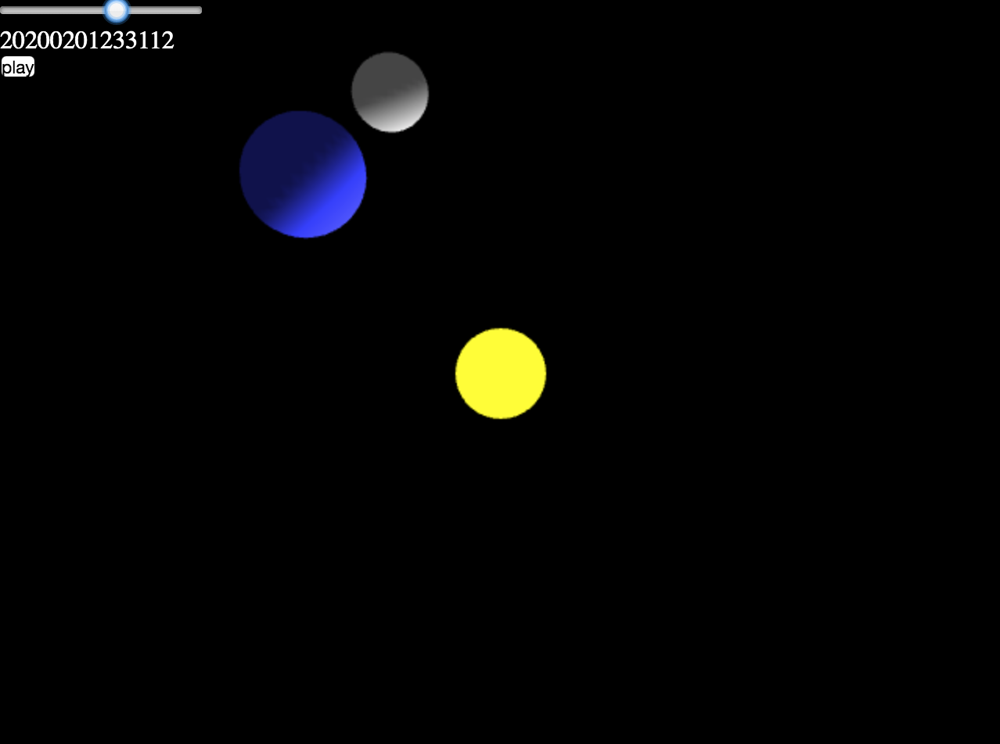

# Dark side

The idea behind this project is to help understand the trajectory of the Moon in our sky.
For this, a dynamic model of the Sun-Earth-Moon system would be rendered in 3D, and displayed from several points of view: as viewed by an observer on the Earth's surface, or from above the ecliptic plan.

This project has been in pause for some years.

